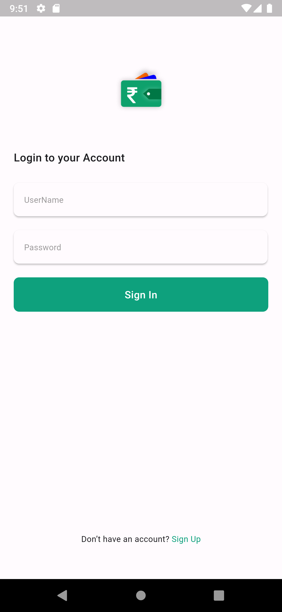
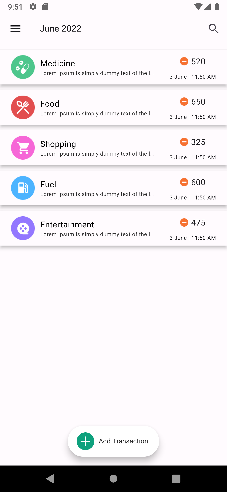
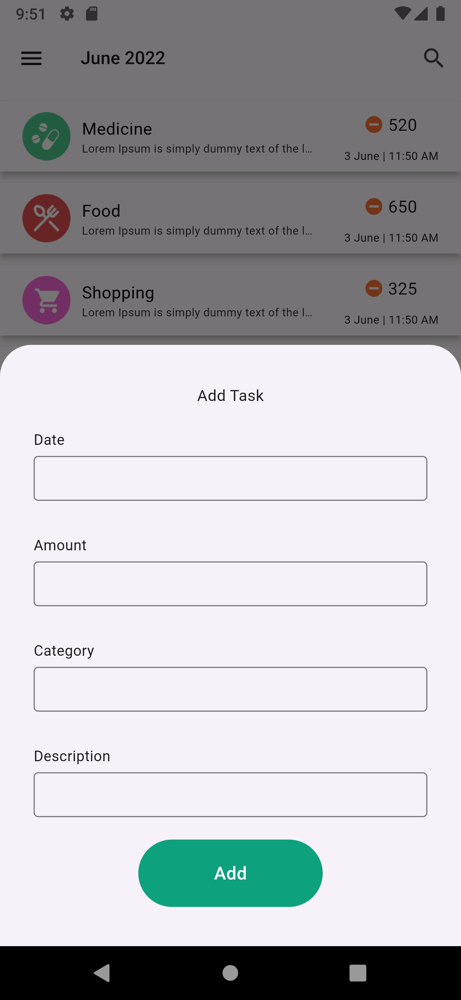

# Expense Tracker

Expense Tracker is a Flutter project designed for UI practice. It includes the following screens:

1. Splash Screen
2. Login Screen
3. Signup Screen
4. Home Screen
5. Add Task (Bottom Sheet)

## Screenshots

### Splash Screen

### Login Screen

### Signup Screen

### Home Screen

### Add Task (Bottom Sheet)

## Getting Started

To run this project locally, follow these steps:

1. Clone the repository:
    
   git clone https://github.com/ganeshnitalikar/Expense-Tracker.git
     
2. Navigate to the project directory:
    
   cd expense_tracker
     
3. Install dependencies:
    
   flutter pub get
     
4. Run the app:
    
   flutter run
     

## Contributing

Contributions are welcome! If you find any issues or have suggestions, feel free to open an issue or create a pull request.

## License

This project is licensed under the MIT License - see the [LICENSE](LICENSE) file for details.
  
