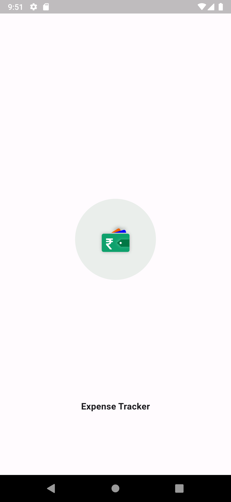
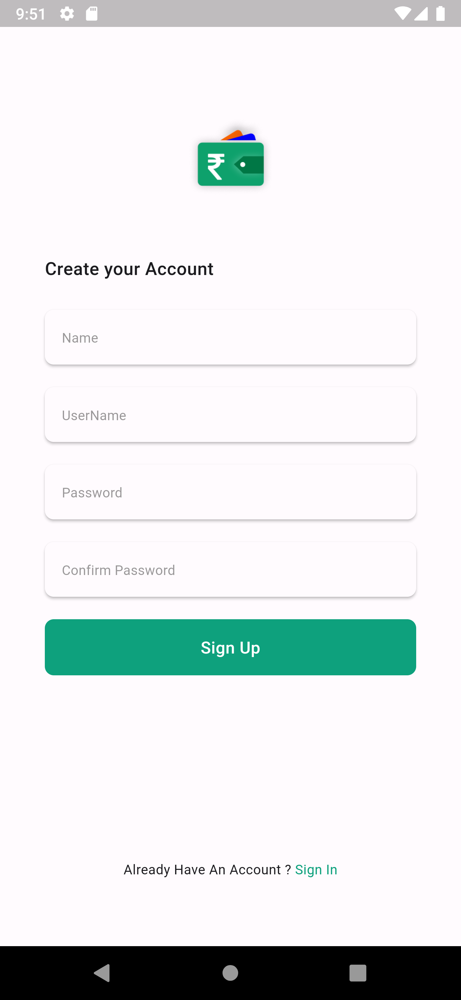

Here's a sample README.md file for your Expense Tracker Flutter project with added screenshots:

```markdown
# Expense Tracker

Expense Tracker is a Flutter project designed for UI practice. It includes the following screens:

1. Splash Screen
2. Login Screen
3. Signup Screen
4. Home Screen
5. Add Task (Bottom Sheet)

## Screenshots

### Splash Screen


### Login Screen


### Signup Screen


### Home Screen


### Add Task (Bottom Sheet)


## Getting Started

To run this project locally, follow these steps:

1. Clone the repository:
   ```bash
   git clone https://github.com/username/expense_tracker.git
   ```
2. Navigate to the project directory:
   ```bash
   cd expense_tracker
   ```
3. Install dependencies:
   ```bash
   flutter pub get
   ```
4. Run the app:
   ```bash
   flutter run
   ```

## Contributing

Contributions are welcome! If you find any issues or have suggestions, feel free to open an issue or create a pull request.

## License

This project is licensed under the MIT License - see the [LICENSE](LICENSE) file for details.
```
